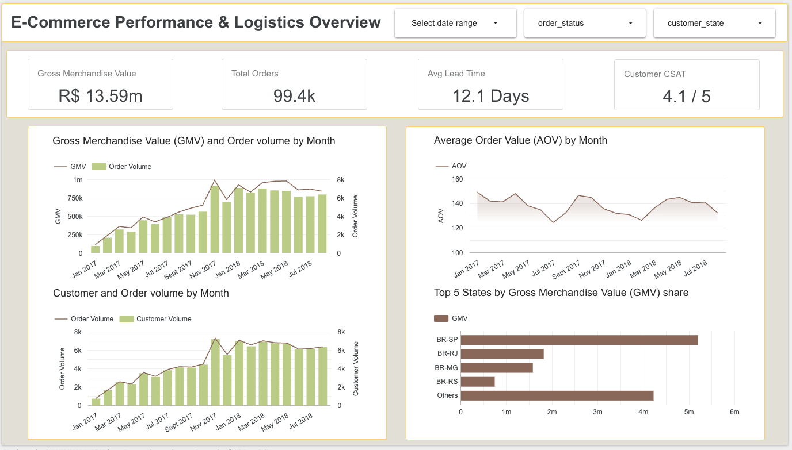

# Olist E-Commerce Analytics

An end-to-end data engineering and BI solution built on 100k+ Brazilian e-commerce transactions (Olist dataset). This project transforms raw transactional data into an analytics mart and a 2-page Looker Studio dashboard designed to diagnose commercial growth drivers and regional logistics bottlenecks.

---

## Executive Summary & Strategic Insights

* To be completed

---

## Technical Architecture

```text
[ Raw Olist Datasets ] 
       │
       ▼
[ Google BigQuery ]
       │
       ▼
[ Looker Studio ]
```

## Dashboard Architecture

### Page 1: Commercial Overview & Demand



* **Tier 1 (KPI Scorecards):** Total GMV, Total Delivered Orders, Unique Active Buyers, Overall Average Order Value (AOV).
* **Tier 2 (Trends):** Monthly Revenue & Order Volume (Combo Chart) alongside Unique Customer Trajectory.
* **Tier 3 (Diagnostics):** Basket Economics (AOV Trend) and Top States by GMV Share.
